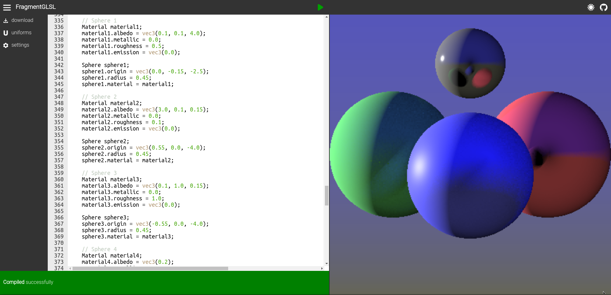

# FragmentGLSL

Play with fragment shaders (glsl) in real time.

> Still in development

## Features
* Fancy code editor.
* GLSL viewer.
* Dark/Light mode.
* Uniforms.
* Real time compilation.
* Error output.

## Screenshots

